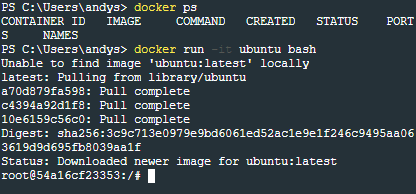
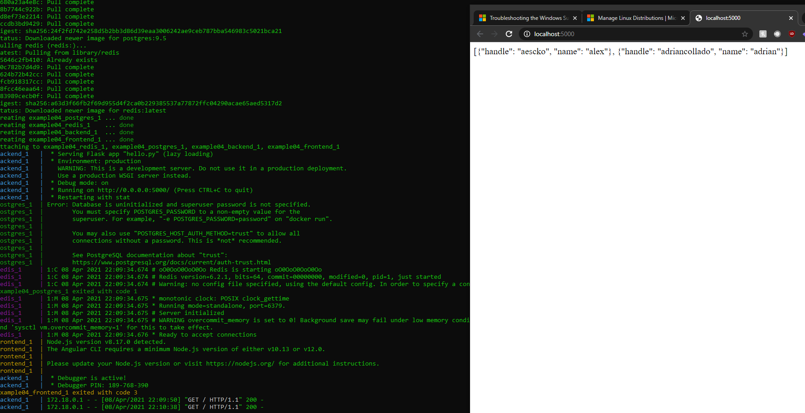

# Lab8

# Example 00 

# Example 01 

# Example 02 

A server error was seen, it seems that oplog is missing. However, this is out of the scope of this lab. 
# Example 03

# Example 04 

An error occured it seems my nod.js version is out of dae. However, this is out of the scope of this lab. A picture of access to the backend was provided as proof that everything else works. 
